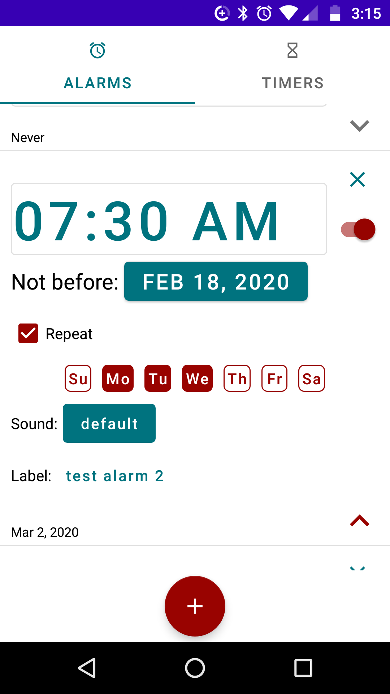
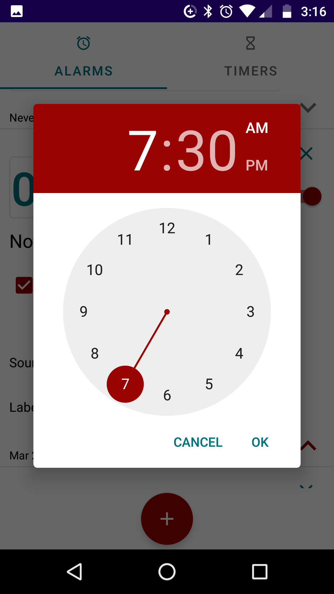
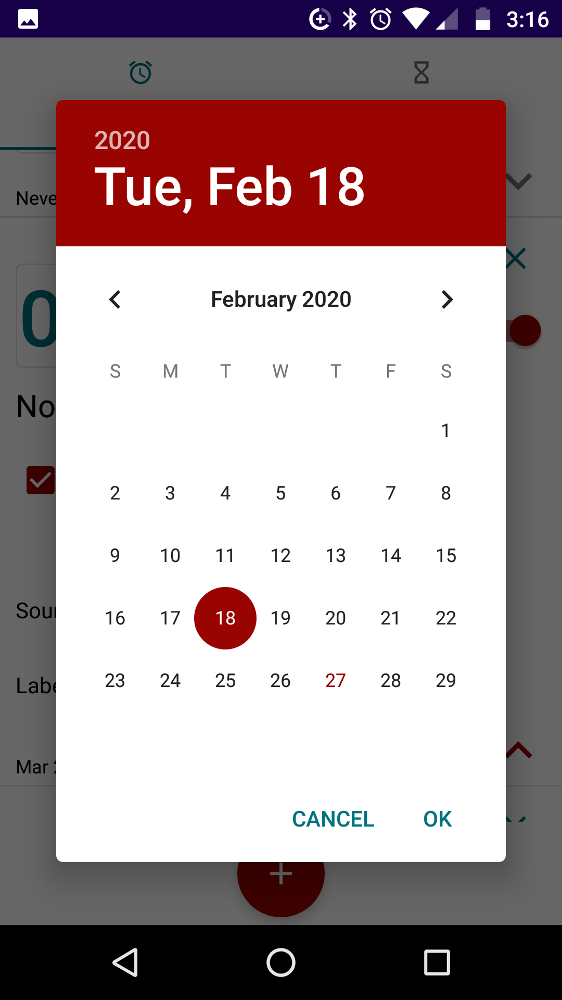
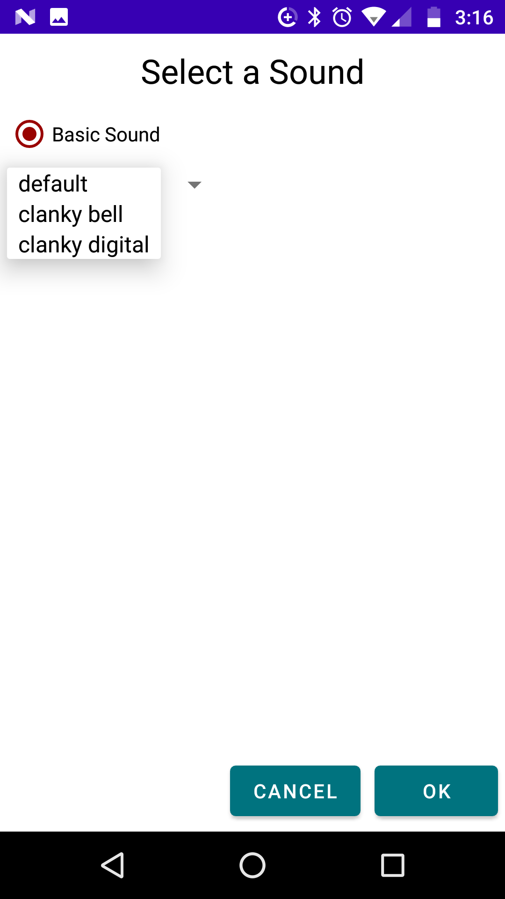

# jumpyalarm

Open-source alarm app

First, let's call this what it is.  This project space exists mainly to prove to prospective employers that I do exist and I can code.

I'm attempting to copy the alarm functionality off of my Android phone with the hopes of adding custom capability in the future.
Currently, this app does not actually trigger any sort of sound or notification.
The initial focus is on getting enough of the GUI and SQLite database components up and running to drive the design and implementation of
the job scheduling component that will schedule and trip the user-configured alarms.

